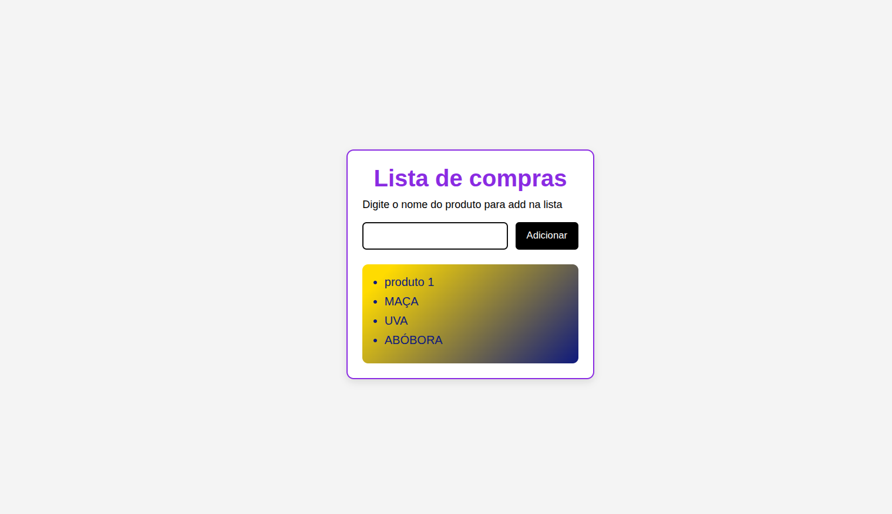

# listaDeCompras
# 🛒 Lista de Compras (HTML, CSS e JavaScript)

Este é um projeto simples de **lista de compras**, criado para praticar manipulação do DOM e eventos em JavaScript. Nele, você pode adicionar produtos dinamicamente a uma lista, com interface amigável e estilização moderna.

---


## 📸 Preview



---

## ✅ Funcionalidades

- ✅ Adiciona produtos digitados em um campo de texto à lista.
- ✅ Impede o envio de produtos vazios.
- ✅ Atualiza dinamicamente a lista na tela.
- ✅ Interface responsiva e estilizada com CSS puro.

---

## 🖥️ Tecnologias utilizadas

- HTML5
- CSS3
- JavaScript 

---

## 📂 Estrutura do Projeto

```
/index.html        --> Estrutura da página
/estilos.css       --> Estilo da aplicação
/scripts.js        --> Lógica da lista (JavaScript)
```

---

## 📋 Como executar

1. Clone este repositório:
```bash
git clone https://github.com/CharlesThomaz/listaDeCompras.git
```

2. Abra o arquivo `index.html` no navegador.

---

## 👨‍💻 Autor

Feito com 💜 por [Charlão]

---

## 📄 Licença

Este projeto está licenciado sob a licença MIT.
